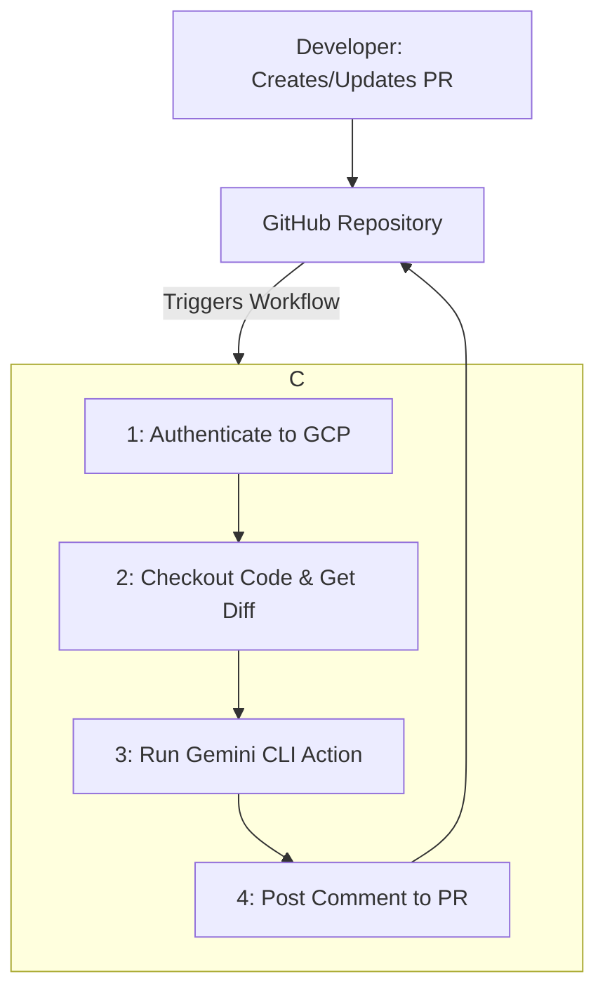

# `space-gemini-gateway`와 Vertex AI를 활용한 자동 코드 리뷰 시스템 구축 가이드

이 문서는 GCP Compute Engine VM(`space-gemini-gateway`)을 Self-Hosted Runner로 사용하고, **Vertex AI** 인증을 통해 `google-github-actions/run-gemini-cli` GitHub Action으로 Pull Request(PR) 코드 리뷰를 자동화하는 시스템을 구축하기 위한 기술 가이드입니다.

---

## 1. 🎯 시스템 개요 (System Overview)

### 목표
- `space-gemini-gateway` VM의 자원을 활용하여 비용 효율적으로 코드 리뷰 자동화를 구현합니다.
- PR이 생성되거나 업데이트될 때마다 코드 변경분을 기반으로 Gemini AI의 리뷰를 제공하여 코드 품질을 향상시킵니다.
- 모든 리뷰와 토론을 Pull Request 내에서 진행하여 개발 워크플로우를 간소화합니다.

### 아키텍처

PR 이벤트가 발생하면 GitHub Action이 트리거되고, 지정된 Self-Hosted Runner(`space-gemini-gateway`)에서 정의된 작업(Job)을 수행하여 PR에 리뷰 코멘트를 남깁니다.



---

## 2. 🛠️ 사전 준비 (Prerequisites)

- **GitHub Repository:** 적용 대상이 될 GitHub 저장소.
- **GCP Project ID:** 대상 GCP 프로젝트의 ID.
- **GCP Compute Engine 인스턴스:** `space-gemini-gateway` (zone: `asia-northeast3-a`)
- **GCP Service Account Key:** Vertex AI API에 접근하기 위한 서비스 계정 키 파일.
    1. GCP Console에서 **IAM & Admin > Service Accounts**로 이동합니다.
    2. `CREATE SERVICE ACCOUNT`를 클릭합니다.
    3. 계정 이름(예: `gemini-code-reviewer`)을 입력하고 `CREATE AND CONTINUE`를 클릭합니다.
    4. **Role**로 `Vertex AI User`를 선택하고 `CONTINUE`, `DONE`을 차례로 클릭합니다.
    5. 생성된 서비스 계정의 목록에서 방금 만든 계정의 이메일 주소를 클릭합니다.
    6. **KEYS** 탭으로 이동합니다.
    7. `ADD KEY > Create new key`를 선택하고, Key type으로 **JSON**을 선택한 후 `CREATE`를 누릅니다.
    8. JSON 키 파일이 컴퓨터에 다운로드됩니다. 이 파일의 내용을 코드나 저장소에 직접 커밋하지 말고 안전하게 보관하세요.

---

### 💡 왜 서비스 계정을 사용해야 하나요?

API 키 대신 서비스 계정을 사용하는 것은 GCP의 권장 보안 방식입니다. 서비스 계정은 IAM을 통해 특정 리소스에 대한 세분화된 권한을 부여할 수 있으며, 키 유출 시에도 피해 범위를 최소화하고 빠르게 대응할 수 있습니다. 특히 팀 단위나 프로덕션 환경에서는 서비스 계정 또는 Workload Identity Federation 사용이 강력히 권장됩니다.

## 3. 📝 단계별 구축 가이드

### Step 1: Compute Engine에 Self-Hosted Runner 설치

먼저 `space-gemini-gateway` VM에 접속하여 GitHub Actions Runner 에이전트를 설치해야 합니다.

1.  **VM 접속:**
    아래 명령어를 사용하여 터미널에서 VM에 접속합니다.
    ```bash
    gcloud compute ssh space-gemini-gateway --zone=asia-northeast3-a
    ```

2.  **Runner 에이전트 설치 스크립트 실행:**
    - GitHub 저장소의 **Settings > Actions > Runners > New self-hosted runner**로 이동합니다.
    - OS로 **Linux**를 선택하면, 화면에 나타나는 `Download`와 `Configure` 섹션의 명령어들을 복사하여 VM 터미널에 순서대로 붙여넣고 실행합니다. 이 과정이 끝나면 Runner 에이전트가 설치되고 GitHub 저장소에 성공적으로 연결됩니다.

### Step 2: GitHub Secrets 설정

GCP 프로젝트 정보와 서비스 계정 키를 GitHub의 암호화된 Secrets에 안전하게 저장합니다.

1.  GitHub 저장소의 **Settings > Secrets and variables > Actions**로 이동합니다.
2.  **New repository secret** 버튼을 클릭합니다.
3.  **Name**에 `GCP_PROJECT_ID`를 입력하고, **Secret**에 자신의 GCP 프로젝트 ID를 붙여넣은 후 **Add secret**을 누릅니다.
4.  다시 **New repository secret** 버튼을 클릭합니다.
5.  **Name**에 `GCP_SA_KEY`를 입력하고, **Secret**에는 사전 준비 단계에서 다운로드한 서비스 계정 JSON 파일의 **전체 내용**을 복사하여 붙여넣습니다.
6.  **Add secret**을 눌러 저장합니다.

### Step 3: Workflow 파일 생성 및 작성

프로젝트의 루트 경로에 `.github/workflows/` 디렉토리를 생성한 후, 그 안에 `gemini_reviewer.yml` 파일을 생성하고 아래의 전체 코드를 붙여넣습니다.

```yaml
# .github/workflows/gemini_reviewer.yml
name: Gemini AI Code Review

on:
  pull_request:
    types: [opened, synchronize]

jobs:
  review:
    # Self-Hosted Runner를 사용하도록 지정합니다.
    runs-on: self-hosted
    
    # PR에 코멘트를 작성하기 위한 권한을 부여합니다.
    permissions:
      contents: read
      pull-requests: write

    steps:
      # 1. GCP 인증
      # GOOGLE_APPLICATION_CREDENTIALS 환경 변수를 설정하는 것과 동일한 효과를 냅니다.
      - name: Authenticate to Google Cloud
        uses: 'google-github-actions/auth@v2'
        with:
          credentials_json: '${{ secrets.GCP_SA_KEY }}'

      # 2. 코드 체크아웃
      - name: Checkout Repository
        uses: actions/checkout@v4
        with:
          fetch-depth: 0 

      # 3. PR의 코드 변경분(diff) 추출
      - name: Get PR Diff
        id: diff
        run: |
          git diff ${{ github.event.pull_request.base.sha }} ${{ github.event.pull_request.head.sha }} > pr_diff.txt
          echo "diff_text<<EOF" >> $GITHUB_OUTPUT
          cat pr_diff.txt >> $GITHUB_OUTPUT
          echo "EOF" >> $GITHUB_OUTPUT

      # 4. Gemini CLI Action을 실행하여 코드 리뷰를 요청합니다.
      - name: Run Gemini for Code Review
        id: gemini_review
        uses: google-github-actions/run-gemini-cli@v1
        with:
          command: |
            tell me "You are an expert code reviewer acting as a helpful senior engineer. Please review the following code diff with a focus on ensuring high code quality and maintainability. Analyze the code for: 1. Potential Bugs, 2. Performance Issues, 3. Security Vulnerabilities, 4. Code Style & Readability, 5. Best Practices. Present your findings in a markdown table with columns: 'File', 'Line(s)', 'Severity (High/Medium/Low)', and 'Suggestion'. If you find no issues, simply respond with: '✅ No significant issues found. Great work!'" < "${{ steps.diff.outputs.diff_text }}"
          project_id: ${{ secrets.GCP_PROJECT_ID }}
          location: asia-northeast3

      # 5. Gemini의 실행 결과를 PR에 코멘트로 작성합니다.
      - name: Post Review Comment to PR
        uses: actions/github-script@v7
        with:
          github-token: ${{ secrets.GITHUB_TOKEN }}
          script: |
            const review = `${{ steps.gemini_review.outputs.result }}`;
            github.rest.issues.createComment({
              owner: context.repo.owner,
              repo: context.repo.repo,
              issue_number: context.issue.number,
              body: `### 🧐 Gemini 코드 리뷰

${review}`
            });
```

모든 설정이 완료되었습니다. 이제 저장소에 Pull Request를 생성하거나 업데이트하면, `space-gemini-gateway` VM에서 워크플로우가 실행되고 PR에 Gemini의 리뷰가 코멘트로 등록됩니다.

---

## 4. 🔑 프롬프트 수정 및 활용

이 자동화 시스템의 핵심은 **Step 3**의 `command` 부분에 있는 프롬프트입니다. 팀의 코드 컨벤션이나 특별히 강조하고 싶은 리뷰 항목이 있다면 이 프롬프트를 자유롭게 수정하여 사용할 수 있습니다. 예를 들어, 특정 에러 처리 방식이나 로깅 규칙을 따르도록 유도하는 내용을 추가할 수 있습니다.
